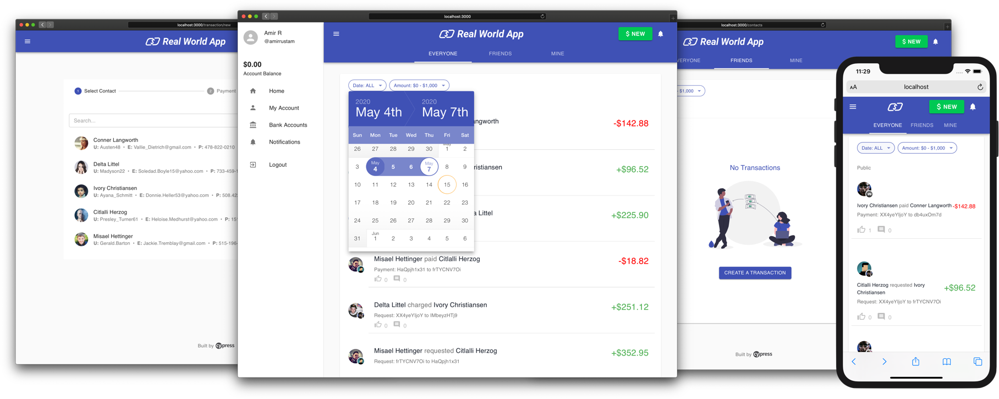

<p align="center">
  <!-- We use two SVGs here so that this displays correctly
    on Github. This might not look right in other Markdown previewers. -->
  
  
</p>

<p align="center">
  <a href="https://cypress.io">
    
    </a>
</p>

<p align="center">
A payment application - similar to <a href="https://venmo.com/" target="_break">Venmo</a> -for use as an 'application under test' for creating automated test scripts.
</p>

<p align="center">
  
</p>

> 💬 **Note for testers**
>
> This application is a snapshot of the <a href="https://github.com/cypress-io/cypress-realworld-app" target="_break">Cypress Real World App</a>, fixed to ensure a stable application to learn, experiment, tinker, and practice application testing. Huge thanks to Cypress for providing and maintaining this application!

---

## Features

🛠 Built with [React][reactjs], [XState][xstate], [Express][express], [lowdb][lowdb], [Material-UI][material-ui] and [TypeScript][typescript]
⚡️ Zero database dependencies
🚀 Full-stack [Express][express]/[React][reactjs] application with real-world features and tests
👮‍♂️ Local Authentication
🔥 Database Seeding

## Getting Started

The Cypress Real-World App (RWA) is a full-stack Express/React application backed by a local JSON database ([lowdb]).

The app is bundled with [example data](./data/database.json) (`data/database.json`) that contains everything you need to start using the app and run tests out-of-the-box.

> 🚩 **Note**
>
> You can login to the app with any of the [example app users](./data/database.json#L2). The default password for all users is `s3cret`.
> Example users can be seen by running `yarn list:dev:users`.

### Prerequisites

This project requires [Node.js](https://nodejs.org/en/) to be installed on your machine. Refer to the [.node-version](./.node-version) file for the exact version.

[Yarn Classic](https://classic.yarnpkg.com/) is also required. Once you have [Node.js](https://nodejs.org/en/) installed, execute the following to install the npm module [yarn](https://www.npmjs.com/package/yarn) (Classic - version 1) globally.

```shell
npm install yarn@latest -g
```

If you have Node.js' experimental [Corepack](https://nodejs.org/dist/latest/docs/api/corepack.html) feature enabled, then you should skip the step `npm install yarn@latest -g` to install Yarn Classic globally. The RWA project is locally configured for `Corepack` to use Yarn Classic (version 1).

#### Yarn Modern

**This project is not compatible with [Yarn Modern](https://yarnpkg.com/) (version 2 and later).**

### Installation

Install the source code be either cloning the repo if you are comfortable using Git, or simply download and extract a ZIP file.

#### ZIP file method:

 - navigate to GitHub repository: <a href="https://github.com/dundas777/realworld-app" target="_break">https://github.com/dundas777/realworld-app</a></li>
 - expand the `<> Code` button and select the 'Download Zip' option - the ZIP fle will then be downloaded
 - create a new folder and extract the downloaded ZIP file into it
 - rename the folder: `realworld-app` instead of `realworld-app-main`

#### GitHub method:

Alternatively, use Git to clone the repo to your local system:

```shell
git clone https://github.com/dundas777/realworld-app
```

#### Install Dependencies

Once the source code has been downloaded, use Yarn to install the application dependencies.

This will take several minutes, time to make a cup of tea!

```shell
cd realworld-app
yarn
```

In Windows you may get an error like: `yarn.ps1 cannot be loaded ... not digitally signed` in which case you need to run this command and then try again.

```shell
Set-ExecutionPolicy -Scope Process -ExecutionPolicy Bypass
yarn
```

Note that you may get this error each time you open a `command` or `terminal` window and attempt to run a `Yarn` command, so if this error occurs then save this command somewhere because you will use it often!

#### Mac users with M-series chips will need to prepend `PUPPETEER_SKIP_CHROMIUM_DOWNLOAD=true`.

```shell
PUPPETEER_SKIP_CHROMIUM_DOWNLOAD=true yarn install
```

### Run the app

```shell
yarn dev
```

> 🚩 **Note**
>
> The app will run on port `3000` (frontend) and `3001` (API backend) by default. Please make sure there are no other applications or services running on both ports.
> If you want to change the default ports, you can do so by modifying `PORT` and `VITE_BACKEND_PORT` variables in `.env` file.
> However, make sure the modified port numbers in `.env` are not committed into Git since the CI environments still expect the application to run on the default ports.


## Database

- The local JSON database is located in [data/database.json](./data/database.json) and is managed with [lowdb].

- The database is [reseeded](./data/database-seed.json) each time the application is started (via `yarn dev`).

- Updates via the React frontend are sent to the [Express][express] server and handled by a set of [database utilities](backend/database.ts)

- Generate a new database using `yarn db:seed`.

- An [empty database seed](./data/empty-seed.json) is provided along with a script (`yarn start:empty`) to view the application without data.

## License

[](https://github.com/cypress-io/cypress/blob/master/LICENSE)

This project is licensed under the terms of the [MIT license](/LICENSE).

[reactjs]: https://reactjs.org
[xstate]: https://xstate.js.org
[express]: https://expressjs.com
[lowdb]: https://github.com/typicode/lowdb
[typescript]: https://typescriptlang.org
[cypresscloud]: https://cloud.cypress.io/projects/7s5okt/runs
[material-ui]: https://material-ui.com
[okta]: https://okta.com
[auth0]: https://auth0.com
[oktacreateapp]: https://developer.okta.com/docs/guides/sign-into-spa/react/create-okta-application/
[cognito]: https://aws.amazon.com/cognito
[awsamplify]: https://amplify.aws
[google]: https://google.com
